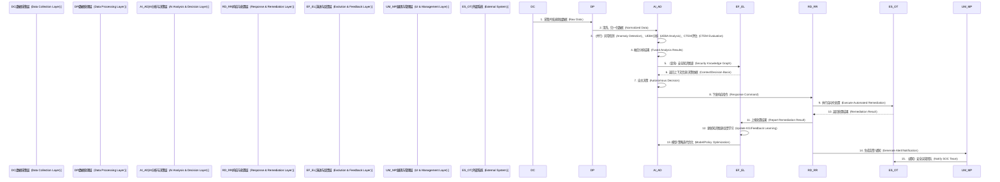

# YShield 项目总体架构设计

## 1. 项目简介

`yshield`（御知）旨在构建一个基于 AI 驱动的闭环式自主安全防御体系。该系统通过整合多源数据感知、智能分析与决策、自动化响应处置和持续进化学习能力，为企业客户提供前瞻性的威胁预测和高效的自动化防护。我们致力于解决传统安全方案在应对复杂、自动化威胁时的响应滞后、误报漏报、人力不足以及知识更新缓慢等核心痛点，实现安全能力的“先知先觉、永不疲倦”。

## 2. 核心设计原则

`yshield` 的架构设计遵循以下核心原则，确保系统的高级性、健壮性、可扩展性与可维护性：

1.  **分层与模块化设计（Layered & Modular Design）**：
    *   采用清晰的多层架构，包括数据采集层、数据处理层、AI 分析与决策层、响应与处置层、演进与反馈层和展现层。
    *   设计灵活的“胶水逻辑”或适配器层，确保各组件（模块）易于独立开发、测试、接入和替换，实现高内聚、低耦合。
2.  **借鉴与创新（Leverage & Innovate）**：
    *   充分吸收并整合如 OpenSOC [1]、Wazuh [2]、Apache Metron [3]（SIEM/XDR），Apache Spot [4]、ELK + Elastic Security [5]（UEBA），Shuffle [6]、StackStorm [7]、TheHive + Cortex [8]（SOAR），MISP [9]、MITRE ATT&CK Navigator [10]、Neo4j Security Knowledge Graph [11]（威胁情报/知识图谱）等开源项目中的实用特性和优秀设计思想。
    *   在此基础上进行优化和创新，尤其是在 AI 自主决策与强化学习、持续威胁暴露管理（CTEM）以及知识图谱驱动的防御进化方面，使项目的组织更合理、功能更强大。
3.  **端到端价值导向（End-to-End Value Driven）**：
    *   优先通过清晰的技术语言（如接口定义、核心数据结构、交互流程）来明确和阐述整体需求，确保设计能够直接映射到最终用户价值和预期效果。
4.  **可测试性（Testability）**：
    *   架构设计高度关注可测试性，确保各模块及整体系统易于进行单元测试、集成测试和端到端测试。所有核心业务逻辑和接口都应易于模拟和测试。
5.  **可观测性（Observability）**：
    *   内建日志（Logging）、指标（Metrics）、追踪（Tracing）机制。项目将包含统一的日志对象 `logger`，并支持分布式追踪（OpenTelemetry [12]）。
6.  **可靠性与容错性（Reliability & Fault Tolerance）**：
    *   充分考虑错误处理机制，项目将集中定义错误类型和常量。采用异步处理、消息队列、重试机制和幂等性设计，确保系统在异常情况下的健壮性。
7.  **高性能与可伸缩性（High Performance & Scalability）**：
    *   架构应支持水平扩展，通过微服务或模块化设计，使不同组件能够独立部署和扩展。采用高效的数据处理框架（如 Apache Flink [13]）和高性能的推理服务。
8.  **安全性（Security）**：
    *   从设计之初就考虑安全因素，遵循安全编码规范，进行输入验证、鉴权授权，防止常见安全漏洞。
9.  **代码质量与可维护性（Code Quality & Maintainability）**：
    *   遵循 Clean Code [14] 原则，确保代码清晰、易懂、易维护。项目将集中定义可枚举类型和公共常量。

## 3. 总体架构设计

`yshield` 的总体架构是一个多层、事件驱动、AI 增强的体系，旨在实现数据的全链路流转、智能分析与自动化响应。

### 3.1. 核心架构视图

以下架构图展示了 `yshield` 的主要组件、层次关系以及数据流向。

```mermaid
graph LR
    %% Legend
    %% 模块命名规则: 大写缩写[中文名称（English Term）]
    %% 节点命名规则: 类型缩写_名称[中文名称（English Name）]
    %% 颜色定义
    %% 数据采集: #ADD8E6 (Light Blue)
    %% 数据处理: #90EE90 (Light Green)
    %% AI分析决策: #FFD700 (Gold)
    %% 响应处置: #FFB6C1 (Light Pink)
    %% 演进反馈: #D8BFD8 (Thistle)
    %% 展现管理: #C0C0C0 (Silver)
    %% 外部系统: #A9A9A9 (Dark Gray)

    subgraph DC[数据采集层（Data Collection Layer）]
        direction LR
        NTA_Collector[网络流量采集器（NTA Collector）] -- TCP/UDP流量 --> NET_Raw[原始网络流量（Raw NetFlow）]
        LOG_Collector[日志采集器（Log Collector）] -- 系统/应用/安全日志 --> LOG_Raw[原始日志数据（Raw Log Data）]
        EDR_Agent[终端Agent（EDR Agent）] -- 进程/文件/行为 --> ENDPT_Raw[原始终端数据（Raw Endpoint Data）]
        TI_Feeder[威胁情报源（Threat Intel Feeder）] -- IOC/TTP/CVE --> THREAT_INTEL_Raw[威胁情报数据（Raw Threat Intel）]
        style DC fill:#ADD8E6,stroke:#333,stroke-width:2px
    end

    subgraph DP[数据处理层（Data Processing Layer）]
        direction LR
        DATA_Ingest[数据摄取（Data Ingestion）] -- 归一化/清洗 --> Normalized_Data[归一化数据（Normalized Data）]
        DATA_Ingest --> Log_Storage[日志存储（Log Storage）]
        style DP fill:#90EE90,stroke:#333,stroke-width:2px
    end

    subgraph AI[AI分析与决策层（AI Analysis & Decision Layer）]
        direction LR
        AI_AnomalyDet[异常检测模型（Anomaly Detection Model）]
        AI_UEBA[用户实体行为分析（UEBA Model）]
        AI_CTEM[持续威胁暴露管理（CTEM Engine）]
        AI_DecisionHub[自主决策中枢（Autonomous Decision Hub）]
        THREAT_INTEL_Engine[威胁情报引擎（Threat Intel Engine）]
        style AI fill:#FFD700,stroke:#333,stroke-width:2px
    end

    subgraph RD[响应与处置层（Response & Remediation Layer）]
        direction LR
        RD_AutoResponse[自动化响应执行（Automated Response Execution）]
        RD_VirtualPatch[虚拟补丁部署（Virtual Patch Deployment）]
        RD_AlertMgmt[告警管理（Alert Management）]
        style RD fill:#FFB6C1,stroke:#333,stroke-width:2px
    end

    subgraph EF[演进与反馈层（Evolution & Feedback Layer）]
        direction LR
        EF_KnowledgeGraph[安全知识图谱（Security Knowledge Graph）]
        EF_Learning[进化学习模块（Evolutionary Learning Module）]
        style EF fill:#D8BFD8,stroke:#333,stroke-width:2px
    end

    subgraph UM[展现与管理层（UI & Management Layer）]
        direction LR
        UM_Dashboard[可视化仪表盘（Dashboard）]
        UM_AlertCenter[告警中心（Alert Center）]
        UM_AuditReport[审计合规报告（Audit & Compliance Reports）]
        style UM fill:#C0C0C0,stroke:#333,stroke-width:2px
    end

    subgraph EX[外部系统（External Systems）]
        direction LR
        EX_SOC[安全运营团队（SOC Team）]
        EX_ExternalTI[外部威胁情报（External TI Sources）]
        EX_Firewall[防火墙/WAF（Firewall/WAF）]
        EX_EDR[终端管控平台（Endpoint Management）]
        style EX fill:#A9A9A9,stroke:#333,stroke-width:2px
    end

    %% 数据流
    NTA_Collector --> DATA_Ingest
    LOG_Collector --> DATA_Ingest
    EDR_Agent --> DATA_Ingest
    THREAT_INTEL_Feeder --> DATA_Ingest

    DATA_Ingest --> Normalized_Data
    Normalized_Data --> AI_AnomalyDet
    Normalized_Data --> AI_UEBA
    Normalized_Data --> AI_CTEM

    THREAT_INTEL_Engine --> AI_AnomalyDet
    THREAT_INTEL_Engine --> AI_UEBA
    THREAT_INTEL_Engine --> AI_CTEM

    AI_AnomalyDet -- 告警/异常 --> AI_DecisionHub
    AI_UEBA -- 行为评分 --> AI_DecisionHub
    AI_CTEM -- 攻击面/漏洞 --> AI_DecisionHub

    AI_DecisionHub -- 响应指令 --> RD_AutoResponse
    AI_DecisionHub -- 虚拟补丁策略 --> RD_VirtualPatch
    AI_DecisionHub -- 告警信息 --> RD_AlertMgmt

    RD_AutoResponse --> EX_Firewall 
    %% 阻断/隔离
    RD_AutoResponse --> EX_EDR 
    %% 主机操作
    RD_VirtualPatch --> EX_Firewall 
    %% WAF规则

    RD_AlertMgmt -- 通知/工单 --> EX_SOC

    RD_AlertMgmt -- 处置结果 --> EF_KnowledgeGraph
    AI_DecisionHub -- 决策数据 --> EF_KnowledgeGraph

    EF_KnowledgeGraph -- 知识更新 --> EF_Learning
    EF_Learning -- 模型优化 --> AI_AnomalyDet
    EF_Learning -- 策略调整 --> AI_DecisionHub
    EF_Learning -- CTEM更新 --> AI_CTEM
    EX_ExternalTI --> THREAT_INTEL_Engine

    %% 展现层与各层交互
    UM_Dashboard -- 查询 --> Log_Storage
    UM_Dashboard -- 查询 --> EF_KnowledgeGraph
    UM_Dashboard -- 查询 --> AI_CTEM
    UM_Dashboard -- 展示 --> RD_AlertMgmt
    UM_AlertCenter -- 管理 --> RD_AlertMgmt
    UM_AuditReport -- 查询 --> Log_Storage
````

**架构解读（Architecture Interpretation）**：

1. **数据采集层（Data Collection Layer）**：

   * **网络流量采集器（NTA Collector）**：负责通过流量镜像等方式，从网络关键节点（如核心交换机、边界路由器）采集原始网络流量数据，并通过深度包检测（DPI）或流日志（如 NetFlow/IPFIX）生成可分析的流量数据。可集成或借鉴 Suricata \[15]、Zeek \[16] 等开源项目。
   * **日志采集器（Log Collector）**：统一收集来自操作系统、应用、各类安全设备（防火墙、IDS/IPS、WAF等）的日志数据，并实时传输至数据处理层。这部分可借鉴 Wazuh \[2]、ELK Stack \[5] 的日志收集能力。
   * **终端 Agent（EDR Agent）**：部署于服务器和关键终端上的轻量级代理，实时监测进程活动、文件操作、网络连接、注册表变更等敏感事件，并上报至后端。此部分可借鉴 osquery \[17] 或 Wazuh Agent \[2] 的思路。
   * **威胁情报源（Threat Intel Feeder）**：负责从外部威胁情报平台（如 MISP \[9]、VirusTotal \[18]、CISA \[19] 等）拉取最新威胁情报（IOC, TTP, CVE 等）。

2. **数据处理层（Data Processing Layer）**：

   * **数据摄取（Data Ingestion）**：接收来自采集层的海量异构数据，进行实时清洗、归一化（如统一为 ECS \[20]、CEF \[21] 格式）、富化。这一层将采用消息队列（如 Kafka \[22]）和流处理引擎（如 Apache Flink \[13]）进行高性能、高吞吐的数据预处理。
   * **日志存储（Log Storage）**：归一化后的数据将存储在分布式存储系统（如 Elasticsearch \[23] 或 ClickHouse \[24]）中，以支持快速查询和分析。

3. **AI 分析与决策层（AI Analysis & Decision Layer）**：

   * **威胁情报引擎（Threat Intel Engine）**：对接收到的威胁情报数据进行解析、关联和索引，提供给其他分析模块进行实时匹配和上下文富化。
   * **异常检测模型（Anomaly Detection Model）**：结合 NTA、日志、EDR 和威胁情报等多源数据，构建多模态异常检测模型，如基于图神经网络（GNN）的 APT 路径检测、基于时序模型（LSTM、Transformer）的网络流量异常检测。此模块可借鉴 SecML \[25]、Adversarial Robustness Toolbox (ART) \[26] 中的模型设计思想。
   * **用户实体行为分析（UEBA Model）**：基于终端行为、日志、网络访问模式，建立用户和实体的行为基线，并利用无监督学习模型（如 Isolation Forest、AutoEncoder、DeepWalk）检测偏离基线的异常行为。可参考 Apache Spot \[4] 的行为分析方法。
   * **持续威胁暴露管理（CTEM Engine）**：模拟攻击路径和攻击树（基于 MITRE ATT\&CK \[27] 框架），结合漏洞扫描结果、资产重要性评估和网络拓扑信息，持续评估企业的攻击面，并生成优先级修复建议和模拟攻击报告。
   * **自主决策中枢（Autonomous Decision Hub）**：此为核心组件，融合异常检测、UEBA 和 CTEM 的输出，通过复杂的规则引擎（如 Drools \[28]）和强化学习模型，进行实时风险评估并自主决策最佳响应策略。它根据风险等级、资产重要性和预设的处置 Playbook \[29] 自动生成响应指令。

4. **响应与处置层（Response & Remediation Layer）**：

   * **自动化响应执行（Automated Response Execution）**：根据自主决策中枢的指令，自动执行各类处置动作，如隔离受感染主机、封禁恶意 IP、阻止可疑进程、回滚恶意更改等。可借鉴 Shuffle \[6]、StackStorm \[7] 的自动化编排能力。
   * **虚拟补丁部署（Virtual Patch Deployment）**：当无法及时打补丁时，系统可通过 WAF 规则、防火墙策略或网络微隔离技术生成“虚拟补丁”，临时阻止漏洞利用。
   * **告警管理（Alert Management）**：对所有检测到的告警进行统一管理、自动分级、去重、关联，并触发通知（邮件、短信、IM）或工单系统（如 TheHive \[8]）。

5. **演进与反馈层（Evolution & Feedback Layer）**：

   * **安全知识图谱（Security Knowledge Graph）**：核心知识库，使用图数据库（如 Neo4j \[30] 或 JanusGraph \[31]）存储企业资产关系、漏洞信息、威胁情报、攻击链、处置经验以及内部安全事件日志。定期从外部威胁情报源（如 MITRE ATT\&CK Taxonomy \[27]、CVE DB \[32]）抓取数据并更新图谱。可参考 Neo4j Security Knowledge Graph Samples \[11]。
   * **进化学习模块（Evolutionary Learning Module）**：基于安全知识图谱和最新监测数据，利用机器学习（尤其是 GNN）对模型参数和决策策略进行持续优化和再训练。通过反馈回路（即处置结果与实际效果），提升 AI 的自学习与适应能力，实现“越用越聪明”。

6. **展现与管理层（UI & Management Layer）**：

   * **可视化仪表盘（Dashboard）**：提供多租户的可视化界面，展示关键安全指标（如平均响应时长、漏洞修复率）、攻击面风险地图、告警分布、威胁情报动态等。可基于 Grafana \[33] 和 Kibana \[34] 定制开发。
   * **告警中心（Alert Center）**：集中展示所有告警，提供告警详情、影响范围、初步分析结论及推荐处置动作，并支持手动干预。
   * **审计合规报告（Audit & Compliance Reports）**：根据行业合规标准（如 PCI-DSS \[35]、HIPAA \[36]、等保 2.0 \[37]）生成定制化的合规性报告，支持导出并定期推送。

### 3.2. 部署架构视图

`yshield` 系统将采用云原生（Cloud Native）的部署方式，基于 Kubernetes \[38] 进行容器化部署与管理，以实现弹性伸缩、高可用性和资源高效利用。

```mermaid
graph LR
    %% Legend
    %% 模块命名规则: 大写缩写[中文名称（English Term）]
    %% 节点命名规则: 类型缩写_名称[中文名称（English Name）]
    %% 颜色定义
    %% 物理/虚拟节点: #FFC0CB (Pink)
    %% Kubernetes组件: #ADD8E6 (Light Blue)
    %% 数据存储: #90EE90 (Light Green)
    %% 消息队列: #FFD700 (Gold)
    %% 外部服务: #A9A9A9 (Dark Gray)

    subgraph User[用户（User）]
        UI_Browser[Web浏览器（Web Browser）]
        style User fill:#F0F8FF,stroke:#333,stroke-width:2px
    end

    subgraph Physical_Env[物理/虚拟环境（Physical/Virtual Environment）]
        direction LR
        NTA_Sensor[NTA传感器（NTA Sensor）] -- 流量镜像 --> K_NTA_Collector[NTA采集器Pod（NTA Collector Pod）]
        LOG_Agent[日志Agent（Log Agent）] -- Syslog/Filebeat --> K_Log_Collector[日志采集器Pod（Log Collector Pod）]
        EDR_Agent[EDR Agent（EDR Agent）] -- 数据上报 --> K_EDR_Service[EDR服务Pod（EDR Service Pod）]
        style Physical_Env fill:#FFC0CB,stroke:#333,stroke-width:2px
    end

    subgraph Kubernetes_Cluster[Kubernetes 集群（Kubernetes Cluster）]
        direction LR

        subgraph K_Data_Ingestion[数据摄取（Data Ingestion）]
            K_NTA_Collector
            K_Log_Collector
            K_EDR_Service
            K_TI_Feeder[威胁情报摄取Pod（TI Feeder Pod）]
            K_Data_Processor[数据处理器Pod（Data Processor Pod）]
            style K_Data_Ingestion fill:#ADD8E6,stroke:#333,stroke-width:2px
        end

        subgraph K_AI_Analysis[AI分析与决策（AI Analysis & Decision）]
            K_Anomaly_Detector[异常检测器Pod（Anomaly Detector Pod）]
            K_UEBA_Engine[UEBA引擎Pod（UEBA Engine Pod）]
            K_CTEM_Engine[CTEM引擎Pod（CTEM Engine Pod）]
            K_Decision_Hub[决策中枢Pod（Decision Hub Pod）]
            style K_AI_Analysis fill:#ADD8E6,stroke:#333,stroke-width:2px
        end

        subgraph K_Response[响应与处置（Response & Remediation）]
            K_Auto_Responder[自动化响应Pod（Auto Responder Pod）]
            K_Virtual_Patcher[虚拟补丁Pod（Virtual Patcher Pod）]
            K_Alert_Manager[告警管理器Pod（Alert Manager Pod）]
            style K_Response fill:#ADD8E6,stroke:#333,stroke-width:2px
        end

        subgraph K_Evolution[演进与反馈（Evolution & Feedback）]
            K_Knowledge_Graph_Service[知识图谱服务Pod（Knowledge Graph Service Pod）]
            K_Learning_Module[进化学习模块Pod（Learning Module Pod）]
            style K_Evolution fill:#ADD8E6,stroke:#333,stroke-width:2px
        end

        subgraph K_Management[管理与展现（Management & Presentation）]
            K_API_Gateway[API网关Pod（API Gateway Pod）]
            K_UI_Service[UI服务Pod（UI Service Pod）]
            style K_Management fill:#ADD8E6,stroke:#333,stroke-width:2px
        end

        K_Data_Processor -- 处理数据 --> K_Anomaly_Detector
        K_Data_Processor -- 处理数据 --> K_UEBA_Engine
        K_Data_Processor -- 处理数据 --> K_CTEM_Engine

        K_Anomaly_Detector --> K_Decision_Hub
        K_UEBA_Engine --> K_Decision_Hub
        K_CTEM_Engine --> K_Decision_Hub

        K_Decision_Hub --> K_Auto_Responder
        K_Decision_Hub --> K_Virtual_Patcher
        K_Decision_Hub --> K_Alert_Manager

        K_Alert_Manager --> K_Knowledge_Graph_Service
        K_Auto_Responder --> K_Knowledge_Graph_Service
        K_Virtual_Patcher --> K_Knowledge_Graph_Service

        K_Knowledge_Graph_Service -- 更新知识 --> K_Learning_Module
        K_Learning_Module -- 模型优化 --> K_Anomaly_Detector
        K_Learning_Module -- 策略更新 --> K_Decision_Hub
        K_Learning_Module -- CTEM更新 --> K_CTEM_Engine

        K_API_Gateway --> K_Anomaly_Detector
        K_API_Gateway --> K_UEBA_Engine
        K_API_Gateway --> K_CTEM_Engine
        K_API_Gateway --> K_Decision_Hub
        K_API_Gateway --> K_Knowledge_Graph_Service
        K_API_Gateway --> K_Alert_Manager
        K_UI_Service --> K_API_Gateway

        K_Data_Ingestion -- 消息队列 --> Kafka_Cluster[Kafka集群（Kafka Cluster）]
        K_AI_Analysis -- 读写 --> Kafka_Cluster
        K_Response -- 读写 --> Kafka_Cluster
        K_Evolution -- 读写 --> Kafka_Cluster

    end

    subgraph Infrastructure_Services[基础设施服务（Infrastructure Services）]
        Log_Store[日志存储（Elasticsearch/ClickHouse）]
        DB_Store[数据库存储（PostgreSQL/MongoDB）]
        Graph_DB[图数据库（Neo4j/JanusGraph）]
        Redis_Cache[缓存（Redis Cache）]
        Model_Repo[模型仓库（Model Repository）]
        style Infrastructure_Services fill:#90EE90,stroke:#333,stroke-width:2px
    end

    subgraph External_Integrations[外部集成（External Integrations）]
        Ext_TI_Sources[外部威胁情报源（External TI Sources）]
        SIEM_Platform[外部SIEM平台（External SIEM Platform）]
        SOAR_Platform[外部SOAR平台（External SOAR Platform）]
        Firewall_Device[防火墙/WAF设备（Firewall/WAF Device）]
        Endpoint_Mgmt_Sys[终端管理系统（Endpoint Management System）]
        style External_Integrations fill:#A9A9A9,stroke:#333,stroke-width:2px
    end

    Physical_Env --> Kubernetes_Cluster
    Kubernetes_Cluster -- 数据持久化 --> Infrastructure_Services
    K_Data_Processor -- 写入 --> Log_Store
    K_Knowledge_Graph_Service -- 读写 --> Graph_DB
    K_Decision_Hub -- 读写 --> DB_Store
    K_Anomaly_Detector -- 读写 --> Model_Repo
    K_Learning_Module -- 读写 --> Model_Repo
    K_API_Gateway -- 读写 --> Redis_Cache

    K_TI_Feeder --> Ext_TI_Sources
    K_Auto_Responder --> Firewall_Device
    K_Auto_Responder --> Endpoint_Mgmt_Sys
    K_Virtual_Patcher --> Firewall_Device

    K_Alert_Manager --> SIEM_Platform 
    %% 可选：向外部SIEM同步告警
    K_Auto_Responder --> SOAR_Platform 
    %% 可选：触发外部SOAR Playbook

    UI_Browser -- HTTPS --> K_API_Gateway
```

**部署架构解读（Deployment Architecture Interpretation）**：

1. **物理/虚拟环境（Physical/Virtual Environment）**：

   * **NTA 传感器（NTA Sensor）**、**日志 Agent（Log Agent）**、**EDR Agent（EDR Agent）**：这些是部署在客户网络环境中的边缘组件，负责数据采集，并将数据安全地传输到 Kubernetes 集群内部的数据摄取服务。

2. **Kubernetes 集群（Kubernetes Cluster）**：

   * 整个 `yshield` 系统将作为一组微服务部署在 Kubernetes 集群中。每个功能模块（如 NTA 采集器、异常检测器、决策中枢等）都将封装为独立的 Pod，通过 Service 进行内部通信，并通过 Ingress/API Gateway 对外暴露服务。
   * **数据摄取（Data Ingestion）**：包含各类数据采集服务的 Pod 和数据处理器 Pod，负责将原始数据进行预处理和归一化。
   * **AI 分析与决策（AI Analysis & Decision）**：包含运行 AI 模型（异常检测、UEBA、CTEM）的推理服务 Pod 和自主决策中枢 Pod。这些 Pod 可以利用 Kubernetes 的 GPU 调度能力来加速 AI 推理。
   * **响应与处置（Response & Remediation）**：包含自动化响应执行、虚拟补丁部署和告警管理的 Pod。这些 Pod 将负责与外部安全设备和系统进行集成与交互。
   * **演进与反馈（Evolution & Feedback）**：包含安全知识图谱服务 Pod 和进化学习模块 Pod，负责知识管理和模型持续优化。
   * **管理与展现（Management & Presentation）**：包含 API 网关和 UI 服务 Pod，为前端用户提供统一的访问入口。

3. **基础设施服务（Infrastructure Services）**：

   * **Kafka 集群（Kafka Cluster）**：作为核心消息队列，解耦各个微服务，实现异步通信和高吞吐量数据传输。
   * **日志存储（Elasticsearch/ClickHouse）**：用于存储海量的归一化日志数据，支持全文检索和分析。
   * **数据库存储（PostgreSQL/MongoDB）**：用于存储系统配置、元数据、策略、告警事件等结构化数据。
   * **图数据库（Neo4j/JanusGraph）**：专门用于存储和查询复杂关系的安全知识图谱。
   * **缓存（Redis Cache）**：用于存储高频访问的数据、Session 信息和短暂状态。
   * **模型仓库（Model Repository）**：存储和管理训练好的 AI 模型。

4. **外部集成（External Integrations）**：

   * `yshield` 设计了与外部安全系统（如防火墙、WAF、终端管理系统、现有 SIEM/SOAR 平台）的接口，实现数据的双向流动和自动化指令的下发，从而融入企业现有安全生态。

### 3.3. 核心业务流程：高可信度威胁的自主处置时序图

以下时序图展示了当系统检测到高可信度威胁时，内部各模块如何协同工作，实现自主决策和响应。



**时序图解读（Sequence Diagram Interpretation）**：

1. **数据采集与处理**：数据采集层（DC）持续收集原始数据，并发送给数据处理层（DP）进行清洗和归一化。
2. **AI 分析**：处理后的数据送至 AI 分析与决策层（AI\_AD）。该层并行执行异常检测、UEBA 分析和 CTEM 评估，生成初步的分析结果。
3. **结果融合与知识查询**：AI\_AD 融合这些分析结果，并查询安全知识图谱（EF\_EL）以获取更丰富的上下文信息，例如攻击手法的关联、资产的重要性等，辅助决策。
4. **自主决策**：基于融合的分析结果和知识图谱的上下文，AI\_AD 中的自主决策中枢进行实时风险评估，并根据预设策略或强化学习模型，自主决定最佳响应动作。
5. **自动化处置**：决策中枢将响应指令下发至响应与处置层（RD\_RR），由其负责与外部系统（ES\_OT，如防火墙、EDR 控制台）集成，执行自动化处置动作（如隔离、封禁、回滚）。
6. **结果反馈与学习**：处置结果返回给 RD\_RR，并由其上报给演进与反馈层（EF\_EL）。EF\_EL 利用处置结果更新安全知识图谱，并通过进化学习模块对 AI 模型和决策策略进行持续优化。
7. **告警与通知**：同时，RD\_RR 会生成相应的告警并发送给展现与管理层（UM\_MP），UM\_MP 则负责通知安全运营团队（ES\_OT）并展示在仪表盘上。

## 4. 项目目录结构规划

我们将遵循标准的 Golang 项目结构，并结合上述架构设计，规划 `yshield` 的目录。

```
yshield/
├── cmd/                          # 应用程序入口，包含main函数和命令行工具
│   ├── api-server/               # API服务器主程序
│   │   └── main.go
│   ├── collector-nta/            # NTA采集器主程序
│   │   └── main.go
│   ├── collector-log/            # Log采集器主程序
│   │   └── main.go
│   ├── collector-edr/            # EDR采集器主程序
│   │   └── main.go
│   ├── processor-data/           # 数据处理器主程序
│   │   └── main.go
│   ├── engine-anomaly-detection/ # 异常检测引擎主程序
│   │   └── main.go
│   ├── engine-ueba/              # UEBA引擎主程序
│   │   └── main.go
│   ├── engine-ctem/              # CTEM引擎主程序
│   │   └── main.go
│   ├── hub-decision/             # 自主决策中枢主程序
│   │   └── main.go
│   ├── responder-auto/           # 自动化响应执行器主程序
│   │   └── main.go
│   ├── responder-virtual-patch/  # 虚拟补丁部署器主程序
│   │   └── main.go
│   ├── manager-alert/            # 告警管理器主程序
│   │   └── main.go
│   ├── graph-knowledge/          # 安全知识图谱服务主程序
│   │   └── main.go
│   ├── learner-evolution/        # 进化学习模块主程序
│   │   └── main.go
│   └── ti-feeder/                # 威胁情报摄取器主程序
│       └── main.go
├── internal/                     # 内部应用或库代码，不对外暴露
│   ├── common/                   # 通用工具、常量、错误、枚举、配置等
│   │   ├── config/               # 全局配置管理
│   │   │   └── config.go
│   │   ├── constant/             # 全局常量定义
│   │   │   └── constant.go
│   │   ├── errors/               # 集中错误定义
│   │   │   └── errors.go
│   │   ├── enum/                 # 全局枚举类型定义
│   │   │   └── enum.go
│   │   ├── logger/               # 统一日志接口与实现
│   │   │   └── logger.go
│   │   ├── metrics/              # 监控指标接口与实现
│   │   │   └── metrics.go
│   │   ├── tracing/              # 分布式追踪接口与实现
│   │   │   └── tracing.go
│   │   └── utils/                # 通用工具函数
│   │       └── utils.go
│   ├── domain/                   # 领域层，包含核心业务实体、值对象、聚合根、领域事件、领域服务和仓储接口定义
│   │   ├── model/                # 领域模型定义（实体、值对象）
│   │   │   ├── asset.go          # 资产模型
│   │   │   ├── alert.go          # 告警模型
│   │   │   ├── event.go          # 事件模型（原始事件、归一化事件）
│   │   │   ├── threat.go         # 威胁模型（IOC, TTP）
│   │   │   ├── behavior.go       # 行为基线模型
│   │   │   └── remediation.go    # 处置动作模型
│   │   ├── repository/           # 仓储接口定义
│   │   │   ├── asset_repo.go
│   │   │   ├── alert_repo.go
│   │   │   ├── event_repo.go
│   │   │   ├── threat_repo.go
│   │   │   ├── behavior_repo.go
│   │   │   └── remediation_repo.go
│   │   └── service/              # 领域服务接口定义（不包含业务逻辑，仅定义协调领域对象行为）
│   │       ├── threat_intelligence_service.go
│   │       ├── attack_surface_service.go
│   │       ├── behavior_analysis_service.go
│   │       └── decision_strategy_service.go
│   ├── infrastructure/           # 基础设施层，实现领域层的接口，如数据库连接、消息队列、外部服务调用、AI推理服务客户端
│   │   ├── persistence/          # 数据库仓储实现
│   │   │   ├── elastic/          # Elasticsearch 实现
│   │   │   │   ├── alert_repo_impl.go
│   │   │   │   └── event_repo_impl.go
│   │   │   ├── neo4j/            # Neo4j 图数据库实现
│   │   │   │   └── knowledge_graph_repo_impl.go
│   │   │   └── postgres/         # PostgreSQL 或其他关系型数据库实现
│   │   │       ├── asset_repo_impl.go
│   │   │       └── behavior_repo_impl.go
│   │   ├── messagequeue/         # 消息队列集成
│   │   │   └── kafka/            # Kafka 生产者和消费者实现
│   │   │       ├── producer.go
│   │   │       └── consumer.go
│   │   ├── aiservice/            # AI推理服务客户端
│   │   │   ├── model_inference.go # 通用模型推理客户端接口
│   │   │   └── triton/           # Triton Inference Server 客户端实现
│   │   │       └── triton_client.go
│   │   ├── external/             # 外部系统集成客户端
│   │   │   ├── firewall/         # 防火墙API客户端
│   │   │   │   └── firewall_client.go
│   │   │   ├── edr/              # EDR系统API客户端
│   │   │   │   └── edr_client.go
│   │   │   ├── misp/             # MISP威胁情报平台客户端
│   │   │   │   └── misp_client.go
│   │   │   └── soarservice/      # SOAR服务API客户端
│   │   │       └── soar_client.go
│   │   └── agent/                # 采集代理的具体实现
│   │       ├── edr/              # EDR Agent 核心逻辑
│   │       │   └── agent.go
│   │       ├── nta/              # NTA Collector 核心逻辑
│   │       │   └── collector.go
│   │       └── log/              # Log Collector 核心逻辑
│   │           └── collector.go
│   ├── application/              # 应用层，协调领域服务，处理业务用例，不包含领域逻辑
│   │   ├── service/              # 应用服务定义
│   │   │   ├── alert_app_service.go
│   │   │   ├── threat_app_service.go
│   │   │   ├── response_app_service.go
│   │   │   └── system_app_service.go # 系统管理、健康检查等
│   │   ├── dto/                  # 数据传输对象定义
│   │   │   ├── alert_dto.go
│   │   │   ├── threat_dto.go
│   │   │   ├── response_dto.go
│   │   │   └── common_dto.go
│   │   └── processor/            # 数据处理模块（对应 Data Processor 服务）
│   │       └── event_processor.go # 事件清洗、归一化、富化逻辑
│   ├── adapter/                  # 适配器层，负责将外部请求或事件转换为应用层或领域层可理解的格式，并反向转换
│   │   ├── http/                 # HTTP API 适配器
│   │   │   ├── handler/          # HTTP 请求处理函数
│   │   │   │   ├── alert_handler.go
│   │   │   │   └── system_handler.go
│   │   │   └── router.go         # HTTP 路由定义
│   │   ├── grpc/                 # gRPC API 适配器
│   │   │   ├── proto/            # Protobuf 定义
│   │   │   │   └── yshield.proto
│   │   │   └── server.go         # gRPC 服务器实现
│   │   └── messagequeue/         # 消息队列事件消费适配器
│   │       └── kafka_event_consumer.go # 消费 Kafka 事件并触发应用服务
│   ├── core/                     # 核心业务逻辑实现（AI 分析与决策层核心实现）
│   │   ├── anomaly/              # 异常检测模块
│   │   │   ├── detector.go       # 异常检测器接口与实现
│   │   │   └── model/            # 具体的检测模型（GNN, LSTM等）
│   │   │       ├── gnn_model.go
│   │   │       └── lstm_model.go
│   │   ├── ueba/                 # UEBA模块
│   │   │   ├── analyzer.go       # UEBA分析器接口与实现
│   │   │   └── baseline/         # 行为基线建模
│   │   │       └── baseline_model.go
│   │   ├── ctem/                 # CTEM模块
│   │   │   ├── manager.go        # CTEM管理器接口与实现
│   │   │   └── attacktree/       # 攻击树与攻击路径模拟
│   │   │       └── attack_tree.go
│   │   ├── decision/             # 自主决策中枢
│   │   │   ├── hub.go            # 决策中枢接口与实现
│   │   │   ├── policy/           # 决策策略管理
│   │   │   │   └── policy_engine.go
│   │   │   └── reinforcement/    # 强化学习模块
│   │   │       └── q_learning.go
│   │   └── intelligence/         # 威胁情报引擎
│   │       └── engine.go         # 情报匹配与富化
│   └── evolver/                  # 演进与反馈层核心实现
│       ├── knowledgegraph/       # 安全知识图谱服务
│       │   ├── service.go        # 知识图谱服务接口与实现
│       │   └── entity/           # 图谱实体定义
│       │       └── entity.go
│       └── learning/             # 进化学习模块
│           ├── trainer.go        # 模型训练器
│           └── feedback/         # 反馈回路处理
│               └── feedback_loop.go
├── pkg/                          # 对外暴露的公共库，可供其他项目或服务引用
│   └── client/                   # 各个微服务的客户端SDK（可选，如果需要外部调用）
│       └── yshield_client.go
├── third_party/                  # 第三方库或协议的特定文件，例如Protobuf生成代码
│   └── protobuf/
│       └── yshield.pb.go
├── docs/                         # 项目文档，包括架构设计、API文档、部署指南等
│   ├── architecture.md           # 本文档
│   ├── api.md
│   ├── deployment.md
│   └── assets/                   # 图片等资源
│       └── yshield-logo.png
├── deployments/                  # 部署相关文件，如Kubernetes YAML、Docker Compose
│   ├── kubernetes/
│   │   └── ...
│   └── docker-compose/
│       └── docker-compose.yaml
├── scripts/                      # 自动化脚本，如构建、测试、部署、代码生成
│   ├── build.sh
│   ├── test.sh
│   ├── deploy.sh
│   └── generate_proto.sh
├── test/                         # E2E测试、集成测试等大型测试
│   ├── e2e/
│   │   └── scenario_test.go
│   └── integration/
│       └── data_flow_test.go
├── .gitignore                    # Git忽略文件
├── go.mod                        # Go模块定义
├── go.sum                        # Go模块依赖校验
├── README.md                     # 项目英文介绍
├── README-zh.md                  # 项目中文介绍
└── LICENSE                       # 开源许可证
```

## 5. 参考资料

- \[1] OpenSOC. GitHub Repository. `https://github.com/OpenSOC/OpenSOC`
- \[2] Wazuh. GitHub Repository. `https://github.com/wazuh/wazuh`
- \[3] Apache Metron. GitHub Repository. `https://github.com/apache/metron`
- \[4] Apache Spot (原 Open Network Insight). GitHub Repository. `https://github.com/apache/spot`
- \[5] Elasticsearch. GitHub Repository. `https://github.com/elastic/elasticsearch`
- \[6] Shuffle. GitHub Repository. `https://github.com/frikky/Shuffle`
- \[7] StackStorm. GitHub Repository. `https://www.github.com/StackStorm/st2`
- \[8] TheHive + Cortex. GitHub Repository. `https://github.com/TheHive-Project/TheHive`
- \[9] MISP (Malware Information Sharing Platform). GitHub Repository. `https://github.com/MISP/MISP`
- \[10] ATT\&CK Navigator. GitHub Repository. `https://github.com/mitre-attack/attack-navigator`
- \[11] Neo4j Security Knowledge Graph Samples. GitHub Repository. `https://github.com/neo4j-contrib/samples-security`
- \[12] OpenTelemetry. Official Website. `https://opentelemetry.io/`
- \[13] Apache Flink. Official Website. `https://flink.apache.org/`
- \[14] Clean Code by Robert C. Martin. Book.
- \[15] Suricata. Official Website. `https://suricata.io/`
- \[16] Zeek. Official Website. `https://zeek.org/`
- \[17] osquery. Official Website. `https://osquery.io/`
- \[18] VirusTotal. Official Website. `https://www.virustotal.com/`
- \[19] CISA (Cybersecurity & Infrastructure Security Agency). Official Website. `https://www.cisa.gov/`
- \[20] Elastic Common Schema (ECS). Official Documentation. `https://www.elastic.co/guide/en/ecs/current/ecs-reference.html`
- \[21] Common Event Format (CEF) by ArcSight. Documentation. `https://www.microfocus.com/media/doc/arcsight-cef-guide/cef_whitepaper.pdf`
- \[22] Apache Kafka. Official Website. `https://kafka.apache.org/`
- \[23] Elasticsearch. Official Website. `https://www.elastic.co/elasticsearch/`
- \[24] ClickHouse. Official Website. `https://clickhouse.com/`
- \[25] SecML. GitHub Repository. `https://github.com/pralab/SecML`
- \[26] Adversarial Robustness Toolbox (ART). GitHub Repository. `https://github.com/Trusted-AI/adversarial-robustness-toolbox`
- \[27] MITRE ATT\&CK. Official Website. `https://attack.mitre.org/`
- \[28] Drools. Official Website. `https://www.drools.org/`
- \[29] SOAR Playbook. General Concept in Cybersecurity.
- \[30] Neo4j. Official Website. `https://neo4j.com/`
- \[31] JanusGraph. Official Website. `http://janusgraph.org/`
- \[32] CVE Database. Official Website. `https://cve.mitre.org/`
- \[33] Grafana. Official Website. `https://grafana.com/`
- \[34] Kibana. Official Website. `https://www.elastic.co/kibana/`
- \[35] PCI DSS (Payment Card Industry Data Security Standard). Official Website. `https://www.pcisecuritystandards.org/`
- \[36] HIPAA (Health Insurance Portability and Accountability Act). Official Website. `https://www.cdc.gov/phlp/publications/overview/hipaa.html`
- \[37] 等级保护 2.0 (Cybersecurity Classified Protection 2.0). Chinese National Standard.
- \[38] Kubernetes. Official Website. `https://kubernetes.io/`